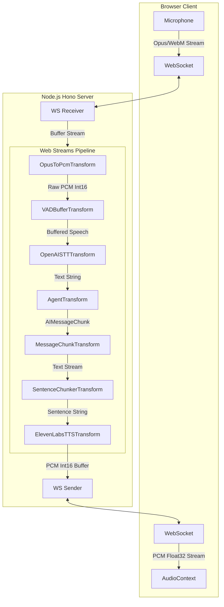

# Voice Sandwich Demo 🥪

A demo of a real-time, voice-to-voice AI pipeline orchestrated using the **Web Streams API** on Node.js.

## Architecture & Data Flow

This project is architected entirely around standard `ReadableStream`, `WritableStream`, and `TransformStream` interfaces. This approach allows for efficient, backpressure-aware data processing where each step in the pipeline handles a specific transformation of the audio or text signal.

### Pipeline Diagram



### The Web Streams Implementation

The core logic resides in `packages/web/src/index.ts`, where the pipeline is composed:

```typescript
inputStream
  .pipeThrough(new OpusToPcmTransform())       // ffmpeg: WebM -> PCM
  .pipeThrough(new VADBufferTransform())       // Silero VAD: Gates stream on speech detection
  .pipeThrough(new OpenAISTTTransform())       // OpenAI Whisper: Audio Buffer -> Text
  .pipeThrough(new AgentTransform(graph))      // LangGraph: Text -> Streaming AI Tokens
  .pipeThrough(new AIMessageChunkTransform())  // Formatting: Chunk -> String
  .pipeThrough(new SentenceChunkTransform())   // Optimization: Buffers tokens into sentences
  .pipeThrough(new ElevenLabsTTSTransform())   // ElevenLabs: Text -> Streaming Audio
```

### Key Components

1.  **`OpusToPcmTransform`**: Spawns an `ffmpeg` process to transcode the incoming browser-native WebM/Opus stream into raw PCM (16kHz, 16-bit, Mono) required for VAD and downstream processing.
2.  **`VADBufferTransform`**: Utilizes `@ericedouard/vad-node-realtime` (running the Silero VAD model via ONNX) to analyze the PCM stream. It acts as a gate, buffering audio frames and only emitting a consolidated buffer when a "speech end" event is triggered.
3.  **`AgentTransform`**: Wraps a **createAgent** / **LangGraph** runnable. It takes a string input (transcription), runs the agent graph, and streams the resulting `AIMessageChunk` objects.
4.  **`ElevenLabsTTSTransform`**: Manages a WebSocket connection to ElevenLabs. It sends text sentences as they become available and yields the returned PCM audio buffers.

## Prerequisites

- **Node.js** (v18+)
- **pnpm** (or npm)
- **ffmpeg** (system installed or via `ffmpeg-static`)
- **API Keys**:
  - `OPENAI_API_KEY`: For Whisper STT.
  - `ELEVENLABS_API_KEY` & `ELEVENLABS_VOICE_ID`: For Text-to-Speech.
  - `GOOGLE_API_KEY`: For the Gemini model driving the LangGraph agent.

## Setup & Running

1.  **Install Dependencies**:
    ```bash
    pnpm install
    pnpm approve-builds
    ```

2.  **Environment Configuration**:
    Create `packages/web/.env`:
    ```env
    OPENAI_API_KEY=sk-...
    ELEVENLABS_API_KEY=...
    ELEVENLABS_VOICE_ID=...
    GOOGLE_API_KEY=...
    ```

3.  **Build**:
    ```bash
    pnpm -r build
    ```

4.  **Start Server**:
    ```bash
    cd packages/web
    pnpm tsx src/index.ts
    ```
    The app will be available at `http://localhost:3000`